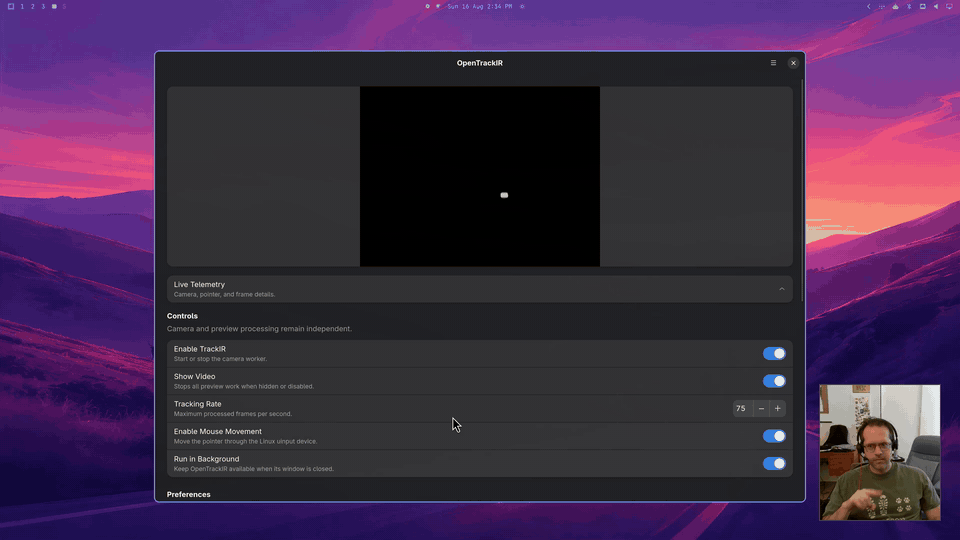

# OpenTrackIR

OpenTrackIR moves the mouse pointer when you move your head. It uses a
NaturalPoint TrackIR infrared camera. The app is an accessibility tool for
people who use head movement as an input method.

OpenTrackIR does not use the proprietary NaturalPoint SDK. It supports macOS,
Windows 11, and Linux. The project is in active development.

## macOS


### Install

1. Download the latest macOS file from the
   [OpenTrackIR releases page](https://github.com/stedwick/OpenTrackIR/releases).
2. Open the downloaded ZIP file.
3. Move `OpenTrackIR.app` to the Applications folder.

### Run

1. Connect the TrackIR camera.
2. Open OpenTrackIR from the Applications folder.
3. Allow Accessibility access when macOS asks for it.

OpenTrackIR can move the pointer after you give this access.

## Windows


### Install

1. Install OpenTrackIR from the [Microsoft Store](https://apps.microsoft.com/detail/9NV04RGTBJKX).
2. Connect the TrackIR camera.
3. Download and open [Zadig](https://zadig.akeo.ie/).
4. Select the TrackIR device in Zadig. The device can have the name `Unknown Device`.
5. Select `WinUSB`.
6. Select **Install Driver**.

Zadig replaces the NaturalPoint driver with WinUSB. The NaturalPoint app cannot
use the camera while this driver is installed. Reinstall the NaturalPoint
driver if you want to use that app again.

### Run

1. Open OpenTrackIR from the Start menu.
2. Select **Refresh** if the app does not find the camera.


## Linux



The current Linux package supports Arch Linux and Omarchy. It uses GTK 4 and
works on X11 and Wayland.

### Install

#### Arch Linux and Omarchy

Open a terminal and run these commands:

```sh
git clone https://github.com/stedwick/OpenTrackIR.git
cd OpenTrackIR/packaging/arch
makepkg --cleanbuild -si
sudo modprobe uinput
```

#### Other Linux distributions

OpenTrackIR does not have packages for other Linux distributions yet. Install
these build tools and development libraries with your package manager:

- A C compiler, CMake, Meson, Ninja, pkg-config, and GNU gettext
- libusb 1.0, GTK 4.12 or newer, libadwaita 1.4 or newer, libevdev 1.10 or newer, and libudev

Then run these commands:

```sh
git clone https://github.com/stedwick/OpenTrackIR.git
cd OpenTrackIR

cmake -S . -B build \
  -DCMAKE_BUILD_TYPE=Release \
  -DOPENTRACKIR_BUILD_PREVIEW=OFF
cmake --build build
sudo cmake --install build

meson setup nix/builddir nix \
  --buildtype=release \
  -Dpkg_config_path=/usr/local/lib/pkgconfig
meson compile -C nix/builddir
sudo meson install -C nix/builddir

sudo ldconfig
sudo modprobe uinput
sudo udevadm control --reload-rules
sudo udevadm trigger --subsystem-match=misc --sysname-match=uinput
```

Disconnect and reconnect the TrackIR camera after installation. You can also
restart the computer.

### Run

Open OpenTrackIR from the application launcher. You can also run this command:

```sh
opentrackir
```

Do not run OpenTrackIR with `sudo`. If you use a terminal, the app stays
attached to that terminal. This behavior is normal.

When you close the window, the app stays in the system tray. Right-click the
tray icon to show or quit the app.

Press **Shift+F7** to turn mouse movement on or off. Your desktop may ask you
to approve this global shortcut the first time. You can also enable the optional
X-keys fast mode in Advanced Controls. Hold the middle pedal for 2.5× speed.

On Omarchy and Hyprland, find **Global Hotkey** in OpenTrackIR. Select
**Install Hotkey** to add Shift+F7 to the detected Hyprland config. OpenTrackIR
creates a backup and checks the config before keeping the change. Select
**Open Config** to inspect or edit the file in your default editor.

## Advanced information

### Project status

OpenTrackIR is an active reverse-engineering project. Some features are
different on each operating system. Our description of the device protocol can
change when tests give new results.

The Python tools are the protocol workbench. The shared C library contains
stable protocol, frame, session, and mouse-tracker code. Each desktop app adds
its user interface and its operating-system input code.

### Cross-platform development

Cross-platform development is interesting. The current project uses one shared
C library and three native user interfaces. This design gives each app good
access to its operating system, but it requires more maintenance.

In the future, I would also like to try [Avalonia](https://avaloniaui.net/) or
[Vercel Labs Native SDK](https://github.com/vercel-labs/native). These tools can
make one user interface work on multiple operating systems.

### macOS troubleshooting

Cursor movement and the optional X-keys foot pedal use different permissions.
Cursor movement uses Accessibility access. The foot pedal uses Input Monitoring
access.

If the pointer does not move after a rebuild, reset the app permissions:

```sh
tccutil reset All philsapps.OpenTrackIR
```

Then do these steps:

1. Quit OpenTrackIR.
2. Open **System Settings > Privacy & Security > Accessibility**.
3. Remove an old OpenTrackIR entry.
4. Open OpenTrackIR again.
5. Allow Accessibility access.

Allow Input Monitoring access if you use the X-keys foot pedal.

### Windows troubleshooting

OpenTrackIR requires the WinUSB driver for the TrackIR camera. Open Zadig and
install WinUSB again if Windows changes the driver.

Only one TrackIR driver can control the camera. Reinstall the NaturalPoint
driver before you use the NaturalPoint app.

### Linux troubleshooting

The Linux package installs rules for the TrackIR USB device, `/dev/uinput`, and
the supported X-keys foot pedals.
The app uses `/dev/uinput` to move the pointer. It does not need a special X11
or Wayland extension.

First, make sure that Linux can see the camera:

```sh
lsusb -d 131d:0159
```

Then make sure that your user can write to `/dev/uinput`:

```sh
test -w /dev/uinput && echo "uinput is writable"
getfacl /dev/uinput
```

If `/dev/uinput` is not available, run these commands:

```sh
sudo modprobe uinput
sudo udevadm control --reload-rules
sudo udevadm trigger --subsystem-match=misc --sysname-match=uinput
```

Disconnect and reconnect the TrackIR camera. Restart the computer if the camera
or `/dev/uinput` is still not available. Do not run OpenTrackIR as root.

If X-keys fast mode reports an access error, reconnect the pedal after installing
or upgrading OpenTrackIR. The permission rule supports USB IDs `05f3:042c` and
`05f3:0438` and grants access only to the pedal-report interface.

Other Hyprland installations that use `hyprland.conf` need this binding:

```ini
bind = SHIFT, F7, global, org.gnome.opentrackir:toggle-mouse
```

For more Linux setup information, read the [Linux README](nix/README.md).

### Background operation

OpenTrackIR continues to track head movement when you hide the window. The app
stops the video preview and telemetry updates while the window is hidden. This
reduces CPU use.

On Linux, use the tray menu to show or quit the app. If the desktop has no tray,
start OpenTrackIR again to show the existing window.

### Repository directories

- `python/` contains USB tests, packet tools, logs, and protocol experiments.
- `c/` contains the shared C library and its tests.
- `cpp/` contains native C++ test programs and the OpenCV preview.
- `mac/` contains the SwiftUI macOS app and the Quartz mouse adapter.
- `win/` contains the WinUI Windows app and Windows input adapters.
- `nix/` contains the GTK Linux app, the uinput adapter, and Linux permission files.
- `packaging/` contains operating-system package files.
- `tmp/` contains temporary test output.

### Native build

The native build requires CMake, a C compiler, and `libusb-1.0`. OpenCV is
optional. Only the C++ preview uses OpenCV.

Run these commands from the repository root:

```sh
cmake -S . -B build -DOPENTRACKIR_BUILD_PREVIEW=OFF
cmake --build build
ctest --test-dir build --output-on-failure
```

Run the C stream tool with this command:

```sh
./build/c/opentrackir_stream_dump
```

### Linux development build

The Linux app also requires Meson, Ninja, pkg-config, GTK 4, libadwaita, and
libevdev.

Run these commands from the repository root:

```sh
opentrackir_prefix="$PWD/build/linux-prefix"

cmake -S . -B build \
  -DOPENTRACKIR_BUILD_PREVIEW=OFF \
  -DCMAKE_INSTALL_PREFIX="$opentrackir_prefix"
cmake --build build
ctest --test-dir build --output-on-failure
cmake --install build

meson setup nix/builddir nix \
  -Dpkg_config_path="$opentrackir_prefix/lib/pkgconfig"
meson compile -C nix/builddir
meson test -C nix/builddir --print-errorlogs
meson devenv -C nix/builddir ./src/opentrackir
```

### macOS development build

Open `mac/OpenTrackIR.xcodeproj` in Xcode. Select the `OpenTrackIR` scheme, and
then select **Run**.

Use these commands for a terminal build and the macOS unit tests:

```sh
xcodebuild \
  -project mac/OpenTrackIR.xcodeproj \
  -scheme OpenTrackIR \
  -destination 'platform=macOS' \
  build

xcodebuild \
  -project mac/OpenTrackIR.xcodeproj \
  -scheme OpenTrackIR \
  -destination 'platform=macOS' \
  test -only-testing:OpenTrackIRTests
```

### Python protocol tests

Install [uv](https://docs.astral.sh/uv/). Then run these commands:

```sh
cd python
uv sync
uv run python -m unittest discover -s tests -v
```

Use these commands to test the camera protocol:

```sh
uv run python trackir_tir5v3.py log --log ../tmp/logs/log-manual.log
uv run python trackir_tir5v3.py opencv --log ../tmp/logs/opencv-manual.log
```

The `log` command prints the pointer coordinates. The `opencv` command shows a
video window and a centroid marker.

### Development goals

- Document the TrackIR protocol.
- Start and stop the camera without a vendor SDK.
- Keep shared behavior in portable code.
- Keep operating-system code in its platform directory.
- Add a focused unit test for each new piece of logic.
- Keep the app small, fast, and efficient.
